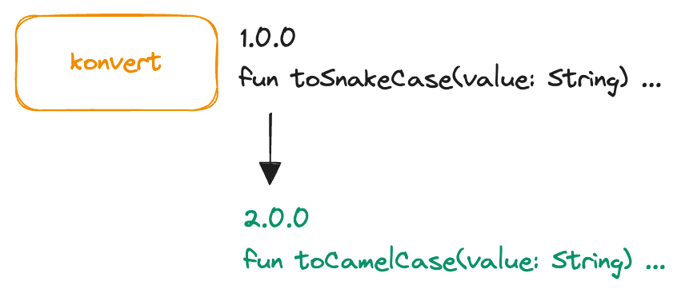

## Contexto

Um dos recursos mais utilizados por desenvolvedores é o versionamento de código permitindo que colaboradores abram pull requests com alterações de código frequentes. Ou seja, em projetos de larga escala, o volume de commits que são feitos e gerados são grandes. Avaliar cada pull request manualmente, fazendo checkout da branch, executando os testes, verificando formatação, pode ser extremamente oneroso e não garantindo que todas as etapas sejam executadas seguindo um padrão.

## Explorando o projeto

Para apresentar o fluxo de trabalho, iremos utilizar uma lib de exemplo criada que contém duas funções: uma que converte para snake case e outra que converte a string para camel case.

Para conhecer mais sobre a lib, acesse: [konvert](http://github.com/wechoo/konvert)

## Adicionando uma funcionalidade

A biblioteca Konvert na versão 1.0.0 contém apenas a função que converte a string para snake case. Mas a medida que essa biblioteca for crescendo e novas funcionalidades forem sendo adicionadas, como podemos fazer para automatizar o nosso fluxo de trabalho e garantir que as versões que estão sendo disponibilizadas para uso, seguem o padrão exigido pelos colaboradores? Como podemos fazer para automatizar o processo para disponibilizar uma nova versão?



## CI/CD

Esse processo automatizado é o propósito do CI/CD para otimizar o ciclo de vida de desenvolvimento adicionando as validações necessárias para gerar uma mudança em seu código. 

Isso facilita tanto o processo de desenvolvimento e checagem das etapas que foram definidas quanto, após o momento em que um código foi gerado e estabilizado na branch principal da sua aplicação, um build pode ser gerado e feito o deploy automático sem a necessidade de fazer as adaptações e implementações manuais.

## Fluxos de trabalho [workflow]

Criar um fluxo de trabalho [workflow] em nossos repositórios auxilia nosso processo de desenvolvimento por quê podemos adicionar em nossa pipeline validações e etapas de verificação automatizadas. Essas etapas são customizadas e geralmente envolvem processos de verificação como: testes, regras de lint e formatação, build. Dessa maneira, podemos criar regras de quando essas etapas serão disparadas e ter um retorno mais rápido ao desenvolvedor, permitindo que o processo de pull request seja focado no contexto de arquitetura e não em processos de revisão automáticas.

O fluxo de trabalho é definido através de um ou mais arquivos do tipo `YAML` e são definidos dentro do diretório: `.github/workflows` do repositório do seu projeto. As etapas que você deseja adicionar podem ser separados em contextos ou arquivos diferentes de implementação.

### Explorando o arquivo

Existem várias configurações que podem ser adicionadas no seu fluxo de trabalho, mas a base consiste geralmente em: 

- O nome da action;
- A partir de qual ação esse fluxo será disparado;
- Os passos que serão executados para validar essa action.

Ou seja, podemos resumir em:

```yaml
name: # O nome do fluxo de trabalho será executado quando...
on: # Alguma ação for disparada, por exemplo, abrir um pull request para a master e...
jobs: # As etapas a seguir serão executadas.
```


