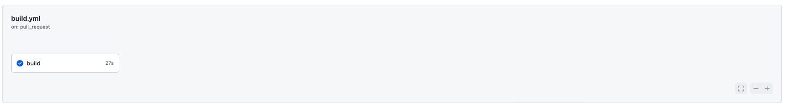
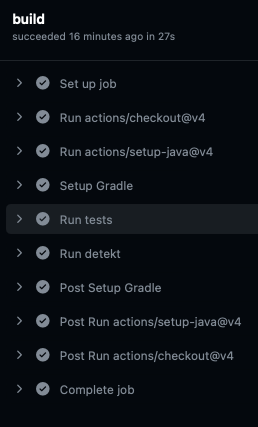
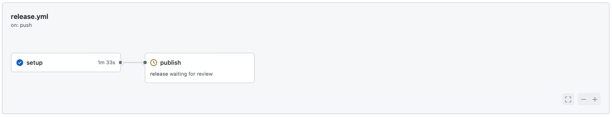

# Contexto

Um dos recursos mais utilizados por desenvolvedores é o versionamento de código permitindo que colaboradores abram pull requests com alterações de código frequentes. Ou seja, em projetos de larga escala, o volume de commits que são feitos e gerados são grandes. Avaliar cada pull request manualmente, fazendo checkout da branch, executando os testes, verificando formatação, pode ser extremamente oneroso e não garantindo que todas as etapas sejam executadas seguindo um padrão.

## Explorando o projeto

Para apresentar o fluxo de trabalho, iremos utilizar uma lib de exemplo criada que contém duas funções: uma que converte para snake case e outra que converte a string para camel case.

Para conhecer mais sobre a lib, acesse: [konvert](http://github.com/wechoo/konvert)

### Adicionando uma funcionalidade

A biblioteca Konvert na versão 1.0.0 contém apenas a função que converte a string para snake case. Mas a medida que essa biblioteca for crescendo e novas funcionalidades forem sendo adicionadas, como podemos fazer para automatizar o nosso fluxo de trabalho e garantir que as versões que estão sendo disponibilizadas para uso, seguem o padrão exigido pelos colaboradores? Como podemos fazer para automatizar o processo para disponibilizar uma nova versão?


# CI/CD

Esse processo automatizado é o propósito do CI/CD para otimizar o ciclo de vida de desenvolvimento adicionando as validações necessárias para gerar uma mudança em seu código. 

Isso facilita tanto o processo de desenvolvimento e checagem das etapas que foram definidas quanto, após o momento em que um código foi gerado e estabilizado na branch principal da sua aplicação, um build pode ser gerado e feito o deploy automático sem a necessidade de fazer as adaptações e implementações manuais.

## GitHub Actions

O GitHub Actions é uma plataforma que permite que a gente execute esses processos, desde a compilação até a implantação. Você pode criar fluxos de trabalho que faça a validação a partir de um determinado evento que ocorre no seu repositório.

### Fluxos de trabalho [workflow]

Criar um fluxo de trabalho [workflow] em nossos repositórios auxilia nosso processo de desenvolvimento por quê podemos adicionar em nossa pipeline validações e etapas de verificação automatizadas. Essas etapas são customizadas e geralmente envolvem processos de verificação como: testes, regras de lint e formatação, build. Dessa maneira, podemos criar regras de quando essas etapas serão disparadas e ter um retorno mais rápido ao desenvolvedor, permitindo que o processo de pull request seja focado no contexto de arquitetura e não em processos de revisão automáticas.

O fluxo de trabalho é definido através de um ou mais arquivos do tipo `YAML` e são definidos dentro do diretório: `.github/workflows` do repositório do seu projeto. As etapas que você deseja adicionar podem ser separados em contextos ou arquivos diferentes de implementação.

#### Explorando o arquivo

Existem várias configurações que podem ser adicionadas no seu fluxo de trabalho, mas a base consiste geralmente em: 

- O nome da action;
- A partir de qual evento ou ação esse fluxo será disparado (pull request, master);
- Os passos que serão executados para validar essa action.

Ou seja, podemos resumir em:

```yaml
name: # O nome do fluxo de trabalho será executado quando...
on: # Alguma ação for disparada, por exemplo, abrir um pull request para a master e...
jobs: # As etapas a seguir serão executadas.
```

## Exemplo

No repositório do [konvert](https://github.com/strd-io/konvert) vamos criar uma pasta onde colocaremos os nossos fluxos de trabalho especificado pela própria documentação: `.github/workflows` e criaremos dois contextos:

https://github.com/strd-io/konvert/tree/master/.github/workflows

- [ ] um de build que será executado para validar o pull request;
- [ ] um de release que será executado na master.

### Build

Essa action será executada quando o pull request for aberto e as etapas de teste e detekt serão avaliadas para o sucesso do pull request. O interessante é que você pode colocar restrições para que o merge de um pull request possa ser feito. Etapas podem ser requeridas, approves.

```yaml
name: Build lib # nome do fluxo de trabalho

on: # evento que será disparado, nesse caso, o pull request
  pull_request:
    types:
      - opened
      - edited
      - synchronize
      - ready_for_review

jobs: # quais são as etapas de validação que serão realizadas
  publish:
    runs-on: ubuntu-latest
    steps:
      - uses: actions/checkout@v4
      - uses: actions/setup-java@v4
        with:
          java-version: '17'
          distribution: 'temurin'

      - name: Setup Gradle
        uses: gradle/actions/setup-gradle@417ae3ccd767c252f5661f1ace9f835f9654f2b5 # v3.1.0

      - name: Run tests
        run: ./gradlew test

      - name: Run detekt
        run: ./gradlew detekt
```

Exemplo do resultado da action.



Clicando para ver os detalhes, podemos ver a sequência dos passos que foram executados.



### Release

Já essa action, ele só será disparada quando o pull request for mergeado na master ou quando um commit for realizado. A diferença dessa é que colocamos uma environment com uma restrição nas configurações do nosso repositório para que a etapa de release só seja executada a partir de um approve.

Falaremos um pouco mais disso no próximo conteúdo.

```yaml
name: Publish package to GitHub Packages

on:
  push:
    branches:
      - 'master'

jobs:
  setup:
    runs-on: ubuntu-latest
    steps:
      - uses: actions/checkout@v4
      - uses: actions/setup-java@v4
        with:
          java-version: '17'
          distribution: 'temurin'

      - name: Setup Gradle
        uses: gradle/actions/setup-gradle@417ae3ccd767c252f5661f1ace9f835f9654f2b5 # v3.1.0

      - name: Run tests
        run: ./gradlew test

      - name: Run detekt
        run: ./gradlew detekt

  publish:
    needs: setup
    runs-on: ubuntu-latest
    permissions:
      contents: read
      packages: write
    environment: release
    steps:
      - uses: actions/checkout@v4
      - uses: actions/setup-java@v4
        with:
          java-version: '17'
          distribution: 'temurin'

      - name: Setup Gradle
        uses: gradle/actions/setup-gradle@417ae3ccd767c252f5661f1ace9f835f9654f2b5 # v3.1.0

      - name: Publish package
        run: ./gradlew publish
        env:
          GITHUB_TOKEN: ${{ secrets.GITHUB_TOKEN }}
```

Como adicionamos no ambiente um fluxo de aprovação, para que essa etapa seja executada e a publicação seja feita, é necessário aprovar por uma lista de usuários ou grupos que foi definido na regra do ambiente criada.


